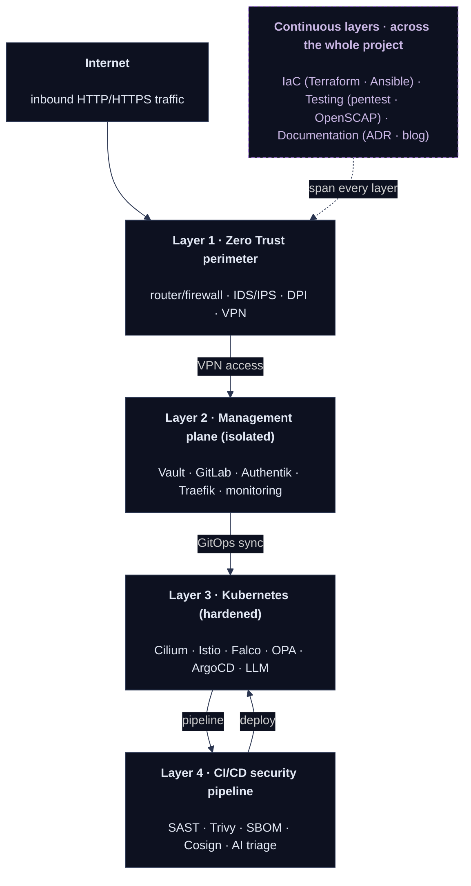
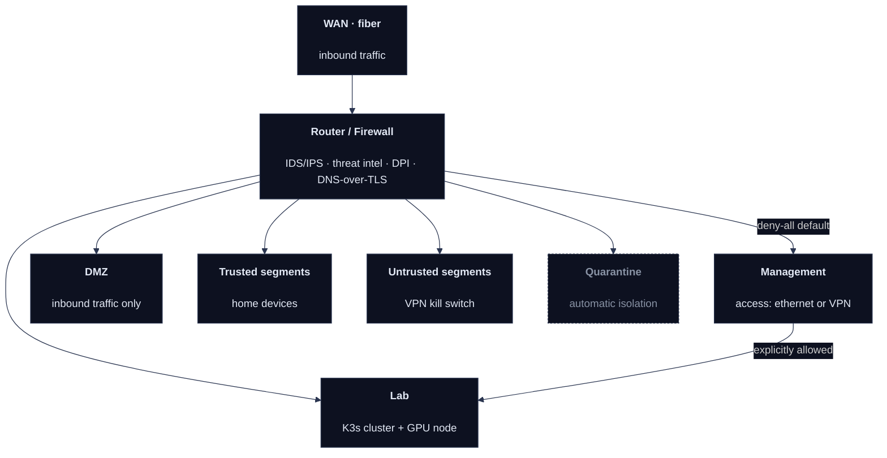
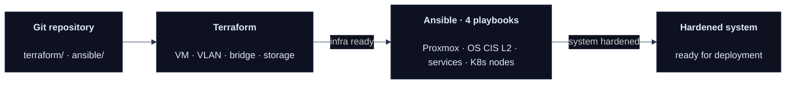
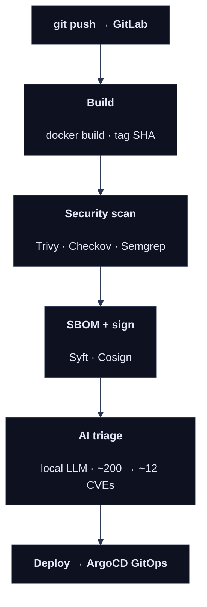
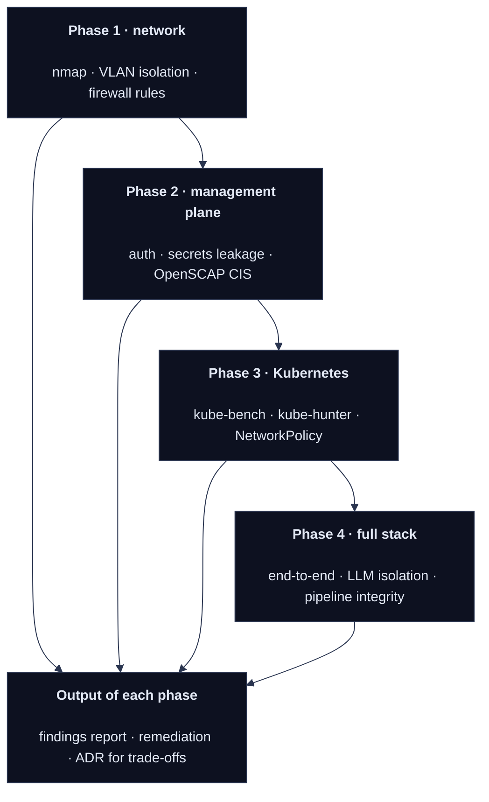

The push toward cloud is huge right now, and I understand why — managed services, automatic scaling, zero infrastructure of your own to run. The problem is that this convenience has a price, and not only a financial one. Cloud platforms abstract away so many layers that we stop knowing how things actually work. And not knowing breeds misconfiguration — on the user's side, not the provider's. Most cloud data leaks aren't a vendor vulnerability; they're a misconfigured bucket, an over-broad IAM role, a forgotten public endpoint.

On top of that comes something rarely said out loud: if you're designing a platform with full control over your trust surface in mind, an external provider becomes an element you don't control — one more entity inside your trust boundary that you have no visibility into.

Subterranea is a working, production-grade hybrid platform: a physical network with Zero Trust segmentation, a Kubernetes cluster with a six-layer security stack, infrastructure managed as code through Terraform and Ansible, self-hosted CI/CD with image signing and SBOM analysis, and local LLM models analyzing CVEs without any external API. Each phase of the project ends with a round of penetration testing — not as a formality, but as proof that what was built actually works. Not on paper.

Built entirely on my own, without university, without a bootcamp — purely out of a need to understand how things really work under the hood.

This article is the map of the whole thing. It will be updated as the project progresses.

---

## Context and motivation

I came from a technical field, and for most of my life I've been pulled in three directions at once: security, automation, and processes. If I had to name a single spark — it was the show "How It's Made." Sounds trivial, but those episodes taught me to look at everything as a process: input, transformation, output, quality control at every stage. Years later it turned out that's exactly how good infrastructure works.

The certifications — KCNA, CKA, CKAD, CKS, RHCSA — I earned on my own, without university, without a bootcamp, in my free time outside of work. Each one represents a specific area I wanted to understand at the level of mechanics, not clicking. I'm one exam away from Kubestronaut — only KCSA left — and I treat it not as a collection of certificates, but as a map of what I went through to be able to say I know what's happening inside a cluster when something goes wrong.

This project is where those three fascinations finally converge in one place. It's not just a technical sandbox — it's a way to show how I approach security and DevOps: not as a checklist of tools to deploy, but as a process that has to be understood, designed, and verified at every step.

Three concrete problems set it in motion:

**The cost of an environment with real complexity.** A few Kubernetes nodes, a service mesh, a monitoring stack, secrets management — on AWS that's a few hundred dollars a month. For an engineer building skills outside working hours, that's a barrier most people avoid by cutting scope. Smaller scope means shallower understanding.

**Abstraction that hides the mechanics.** Managed Kubernetes hides etcd, hides kube-proxy, hides the CNI. You can have no idea what Cilium does and still deploy apps to EKS — right up until something breaks and suddenly you need to know.

**Security as an afterthought.** In the typical homelab tutorial, security shows up as the last item on the list. In a production setting it's built into the architecture from the start. This project treats it the same way — every layer has its own security requirements, and every phase ends with a penetration test that verifies them.

---

## Architecture — a bird's-eye view

The platform has four layers in the main flow. Three continuous layers — IaC, testing, and documentation — cut across all the others and run for the entire duration of the project.

The main flow runs vertically: from the internet through the Zero Trust perimeter, into the isolated management plane, the Kubernetes cluster, and the CI/CD pipeline. The management plane accepts no inbound traffic from the internet — management access is over a physical ethernet link or VPN only. Outbound traffic is restricted to a narrow allowlist: pulling new image versions (scanned and signed in the pipeline), pushing to a public GitHub repository (stripped of sensitive data), and ACME requests to Cloudflare for certificates. Every arrow is an explicit firewall rule or a defined protocol — there's no traffic "allowed by accident." Underneath run three continuous layers that touch every level of the stack throughout the project: Infrastructure as Code (provisioning and hardening), testing (validation after each phase), and documentation (ADRs and this blog, written as I go).

### Hardware

Two physical machines with a clear division of responsibility:

| Role | Profile |
|------|---------|
| Dedicated router | Low-power, fanless · fiber WAN |
| Main server (Proxmox) | Multi-core · ~128 GB RAM · tiered storage (NVMe + SSD + HDD) |

OPNsense runs on the physical router and segments the entire home network. The main server runs Proxmox with several VMs: a Management VM (isolated — no inbound internet traffic, access over ethernet or VPN only, outbound restricted to an allowlist; hosting Vault, GitLab, Traefik, Authentik, and monitoring), the K3s cluster nodes — one of which has a GPU assigned for LLM workloads — and a backup server. The GPU handles two models at once: Llama 8B and DeepSeek R1 7B (both quantized, fitting within the available VRAM).

A deliberate decision: the router is a physically separate machine. A hypervisor failure doesn't touch the network layer — the home network keeps running regardless of what happens on the server.

---

## The network layer — Zero Trust from L2

The network is the foundation. A mistake at this layer invalidates the security of everything above it.

The network is split into segments, each with its own policy. Traffic between segments is blocked by default — every allowance is explicit and documented. The management segment is not reachable from the internet — access is over a physical ethernet link or WireGuard only. The quarantine segment automatically isolates devices that the IDS/IPS has flagged as suspicious. The VLAN numbers and the full segmentation map are deliberately left out of this writeup — that's firewall logic, and it doesn't belong in public documentation.

---

## Infrastructure as Code

Not a single machine in this stack was configured by hand in a console.

**Terraform** manages the Proxmox layer: creating VMs, assigning resources, configuring networking and VLANs, allocating storage. The entire environment can be destroyed and rebuilt from the repository — that's not disaster-recovery theory, it's a real drill the project runs through on every major change.

**Ansible** handles the operating system layer across four playbooks: hardening Proxmox itself (the hypervisor most projects skip, assuming it's "behind NAT"), hardening Rocky Linux to CIS Benchmarks Level 2, configuring services, and preparing the K8s nodes. Every playbook is idempotent.

The whole thing lives in a public repository with sensitive data sanitized — the code is the evidence, not just the description.

---

## CI/CD security pipeline

Every commit triggers the full pipeline. No image reaches the cluster without passing the scan, being signed with a Cosign key, and being verified by admission control (OPA Gatekeeper rejects images without a valid signature). The AI triage stage filters Trivy's output — from the ~200 CVEs found, it pulls out the genuinely exploitable ones and generates a report readable by someone without a security background.

---

## Penetration testing as the condition for closing a phase

Each phase of the project ends with a round of tests. Not a checklist — a real test that tries to find holes in what was built.

The results aren't always clean — and that's exactly why the report from each test is part of the phase documentation, not an attachment for show. Every finding goes into the report with one of three decisions: fix it, accept it as a conscious trade-off (with justification), or flag it as a known issue to resolve in the next phase. I describe the concrete results in separate pentest articles — one per phase.

---

## Project phases

The project has no single "release day" — it has milestones, each with its own scope, Infrastructure as Code layer, and a penetration test that closes the phase.

| Phase | Scope | IaC | Pentest |
|-------|-------|-----|---------|
| **1 · Network foundation** | VLAN segmentation · IDS/IPS · DPI · DNS-over-TLS · WireGuard | Terraform provisioning · Ansible hardening (Proxmox + OS, CIS L2) | network isolation · firewall rule verification |
| **2 · Management plane** | Vault · GitLab · Authentik · monitoring · Docker→Podman→Quadlets · backup 3-2-1 | Ansible service hardening · secrets workflow | auth testing · secrets leakage · OpenSCAP |
| **3 · Kubernetes** | K3s · Cilium · Istio · Falco · Tetragon · OPA · Cosign · SBOM · ArgoCD · GPU | Terraform node provisioning · Ansible node hardening | kube-bench · kube-hunter · NetworkPolicy · admission control |
| **4 · AI and automation** | Ollama · Llama 8B · DeepSeek R1 · CVE triage in CI/CD · n8n · Chaos Mesh | — | full stack · LLM isolation · pipeline integrity |

The phases aren't strictly sequential — observability is live from Phase 1, and backups are deployed alongside every new service. Infrastructure as Code, testing, and documentation are continuous layers: Terraform and Ansible are in use throughout, a pentest closes every phase, and documentation (ADRs and this blog) is written as I go — it's not a final stage, but a process running in parallel with the build.

---

## Methodology: Documented Evolution

Most guides show you the destination. This project documents the journey — including the dead ends, the fixed mistakes, and the consciously accepted trade-offs.

Every article follows the same shape: context -> problem -> decision -> implementation -> what went wrong -> what I'd do differently. There are no "I set up X and it works" articles. If it works — there's an explanation of why. If something caused trouble — there's a description of what it was.

One concrete example of an architectural decision, to show how this works in practice:

> **ADR-003: K3s instead of kubeadm**
>
> *Considered:* kubeadm (full Kubernetes, full control over every component), K3s (lightweight distribution, smaller footprint), minikube/kind (dev only).
>
> *Chose:* K3s.
>
> *Why:* the server hosts the entire platform at once — network, management plane, cluster, and LLM workloads. K3s reduces the control plane's CPU and RAM usage while keeping nearly the full functionality of K8s. Same API, same kubectl, same manifests, same patterns. For a single loaded server, the difference in overhead is real and measurable.
>
> *What I give up:* some components disabled by default (Traefik, servicelb) — but that's actually an advantage, since I want my own CNI (Cilium) and my own ingress anyway. I also give up experience with manually bootstrapping TLS certificates for cluster components. Mitigation: a separate article on what K3s does under the hood.
>
> *Acceptable trade-off:* yes. The skills transfer 1:1 to full K8s.

Every decision in the project has a document like this. A dozen or so ADRs in total — from the choice of hypervisor to the secret rotation policy.

---

## Articles — index

The list is updated as the project progresses. Articles with a link are published; the rest are planned.

### Phase 1 — Network foundation

| # | Title | Status |
|---|-------|--------|
| 01 | Network segmentation as a security primitive | [→ read](#) |
| 02 | The cost of detection — IDS vs IPS on constrained hardware | [→ read](#) |
| 03 | DNS as a security layer | planned |
| 04 | Zero Trust access in practice | planned |
| 05 | Proxmox hardening — the hypervisor nobody secures | planned |
| 06 | Infrastructure as Code with Terraform and Proxmox | planned |
| 07 | OS hardening at scale with Ansible | planned |
| P1 | Phase 1 pentest — what I found and fixed | planned |

### Phase 2 — Management plane

| # | Title | Status |
|---|-------|--------|
| 08 | Self-hosted secrets management with Vault | planned |
| 09 | Docker → Podman → Quadlets: a migration case study | planned |
| 10 | Self-hosted GitLab: what you gain, what you pay | planned |
| 11 | Observability from scratch | planned |
| 12 | Backup strategy: 3-2-1 is not a feeling | planned |
| P2 | Phase 2 pentest — auth, secrets, compliance | planned |

### Phase 3 — Kubernetes

| # | Title | Status |
|---|-------|--------|
| 13 | K3s security hardening — beyond the defaults | planned |
| 14 | Cilium + Istio: why both | planned |
| 15 | Runtime security with Falco and Tetragon | planned |
| 16 | Admission control: policy as code | planned |
| 17 | Software supply chain: SBOM, signing, verification | planned |
| P3 | Phase 3 pentest — breaking Kubernetes | planned |

### Phase 4 — AI and automation

| # | Title | Status |
|---|-------|--------|
| 18 | Running LLMs on-premise: tradeoffs | planned |
| 19 | AI-assisted CVE triage in CI/CD | planned |
| P4 | Phase 4 pentest — the full stack | planned |

---

## Repository

The Terraform code and Ansible playbooks are publicly available. Sensitive data (IP addresses, keys, passwords) is replaced with placeholders — a `README.md` in each directory describes what to substitute.

→ **[github.com/spelunker/subterranea-iac](#)** *(link once the repo is published)*

---

## Who this series is for

For engineers who want to see what it looks like when someone actually builds this — not on managed cloud, not with an unlimited budget, not with an SRE team to lean on.

For recruiters: the repository, the articles, and the ADRs are evidence of reasoning, not just familiarity with tools. The penetration test results are proof that this infrastructure is genuinely verified — not just designed with security in mind.

For anyone building a similar project: the ADRs are public, the comments are open. If I made a bad call — I want to know about it.

We start with the network. Always with the network.

→ [Article 01: Network segmentation as a security primitive](#)
